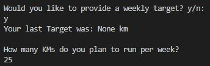
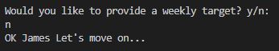
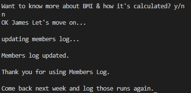
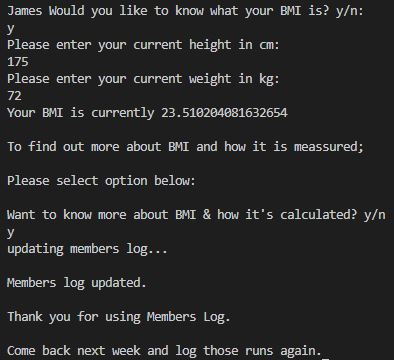
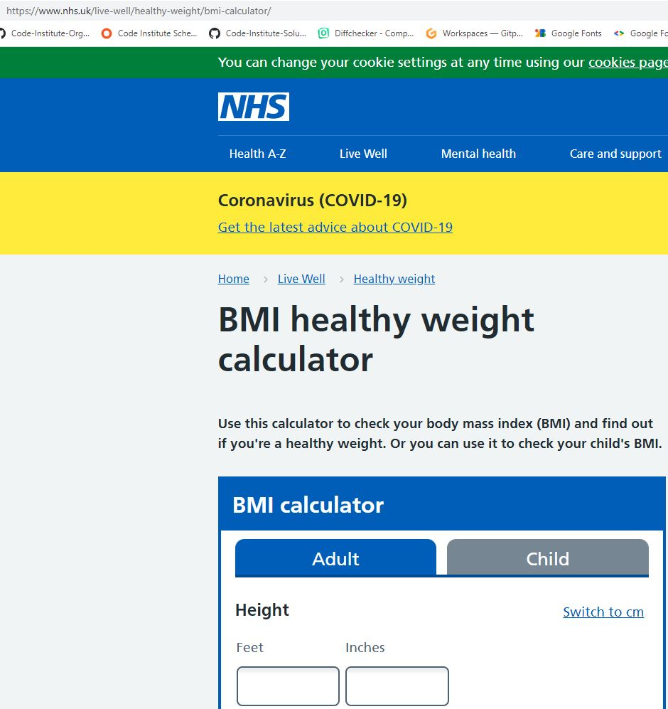
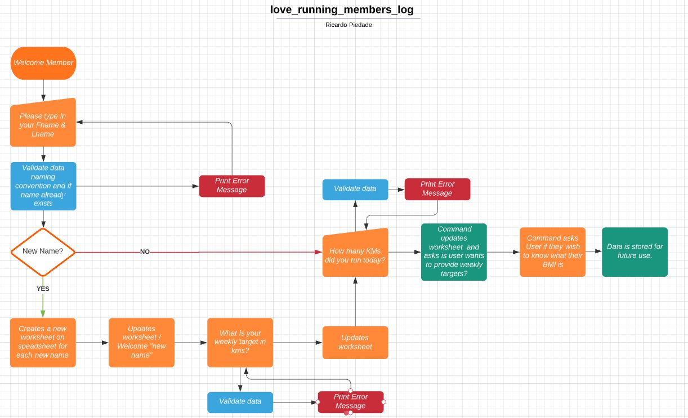
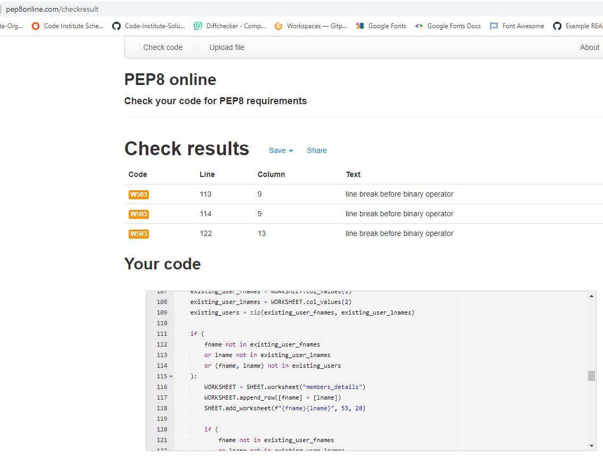

# Welcome to the Love Running Members Log

This project was developed to satisfy the third milestone project requirements of the Full Stack Web Development Program at the Code Institute. As a third project, this program is created using Python3 language.

The objective of this project is to build a command-line program that allows users to manage a common dataset about a particular domain.

This project is an program that allows Users of the Love Running Website to log their runs clocked througout the week.

Users will also have the choice of being able to track and monitor their progress on a weekly basis by choosing to provide total weekly targets to run.

The aplication will also include a feature which calculates Users' Body Mass Index (BMI) together with a link to a National Health Site where they will be able to find information about BMI in more detail.

## Table of Contents
* [Features](Features)
* [Future Features](Future-Features)
* [Data Model](Data-Model)
* [Flow Charts](Flow-Charts)
* [Testing](Testing)
* [Bugs](Bugs)
* [Deployment](Deployment)
* [Credits](Credits)

# Features

## Existing Features

### _**The Introduction Section**_

The User is welcomed with a welcome message and asked to provide a First Name:

### _**The User Response**_

There is a validation at this stage to ensure that the User can only provide an aplha response. If the User fails to provide a correct response, the program will issue an error message and request that the User tries again.

The program will also ask the User for a last name. This step will also have the same validation check as the request for the first name. It is important to stress that a last name is also required in order to avoid Users with the same first name from logging their runs on other Users logs with the same first name. The program will search through the gspreadsheet to ensure that the first name AND last name are unique.

Once the last name is provided, the program triggers another welcome message but with the name of the User included to make it more personalised.

### _**The Users' Daily Logs**_

The next steps are messages from the program that ask the user to provide their daily runs. These messages also inform the User on the format required to input the data.

The User will log their daily runs in the format requested:

The program will then provide the User with a summary of the input data provided. The program will add the total distance and display the total distance to the User. Another message will appear informing the User that the distances will be logged to the database.

### _**The Users' Weekly Targets**_

The program allows the User to monitor their weekly runs. For first time users, should the Users' selection be "y", the program will display a weekly target provided of "none" km as this is the default setting when a new sheet is created. The User will then have the option of typing a weekly target for the week ahead. Upon the Users return the following week, the program will remind and display the Users' target provided the previous week. 

Should the User select "n" for "No", the program will display a message stating moving on....

### _**The Users' BMI Tracker**_

The BMI feature allows the User to monitor their Body Mass Index. The program will give the User the option to monitor their BMI.

Shold the User decide to monitor their BMI, the program will ask the User to input their height and current weight. The Program will then calculate the Users' BMI and display the result to the User.

As an added feature, the program will then ask the user if they'd like to know more about BMI, how its calculated and what the result of their rating means. If the User selects "no", the program will update the database and move on, ending with a message thanking the user and asking them to come back the following week to log their runs again.

If the User selects "y" the program will open a new tab which is directed to a National Health website with all the details about BMI. Once again the program will update the database and move on, ending with a message thanking the user and asking them to come back the following week to log their runs again.

#### _**New Tab Opens**_

The process terminates.

# Future Features

* Add validation to ensure User only provides float or integer responses to their daily runs.
* Add a new feature that will display previous weeks runs and total distance to returning users.
* Add feature to display previous weeks BMI rating to returning users.
* Add round up of User BMI rating to 2 decimal points.

# Data-Model

The program is based on messages and questions displayed by the program to the User for information and for the request of User input.

The program with flow via a series of functions and global variables and based on the User input data which is stored on an external database, in this case Google Spreadsheets is used, the program will provide the User with the relevant output for each feature and the stored information will be used again upon the Users' return to log further runs.

# Flow-Charts

The project was initiated with an idea in mind and a Lucid Chart was used to provide some clarity of the programs features before writing any code.

# Testing

The following tests were undertaken to test this program:

* I have simulated invalid entry of data where strings are required to test if errors are working.
* I have simulated invalid entry of data where floats are required with integers to confirm the program accepts this numerical form and progresses.

#### _**PEP8 Validator Testing**_

* I have passed the code through a PEP8 validation and confirmed there are no issues.

# Bugs

# Deployment

This project was deployed using Code Institute's mock terminal for Heroku.

* Steps for deployment:

    * Create new Heroku app
    * Set the buildbacks to Python and NodeJS in this order
    * Link the Heroku app to the GitHub repository
    * Click on Deploy

# Credits