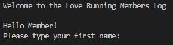
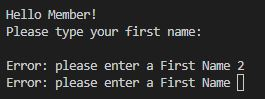
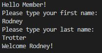
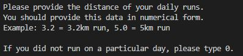
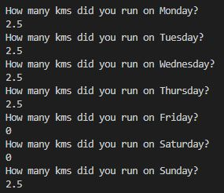
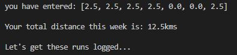

# Welcome to the Love Running Members Log

This project was developed to satisfy the third milestone project requirements of the Full Stack Web Development Program at the Code Institute. As a third project, this application is created using Python3 language.

The objective of this project is to build a command-line application that allows users to manage a common dataset about a particular domain.

This project is an application that allows Users of the Love Running Website to log their runs clocked througout the week.

Users will also have the choice of being able to track and monitor their progress on a weekly basis by choosing to provide total weekly targets to run.

The aplication will also include a feature which calculates Users' Body Mass Index (BMI) together with a link to a National Health Site where they will be able to find information about BMI in more detail.

## Table of Contents
* [Features](Features)
* [Future Features](Future-Features)
* [Data Model](Data-Model)
* [Flow Charts](Flow-Charts)
* [Testing](Testing)
* [Bugs](Bugs)
* [Deployment](Deployment)
* [Credits](Credits)

# Features

## Existing Features

### _**The Introduction Section**_

The User is welcomed with a welcome message and asked to provide a First Name:

### _**The User Response**_

There is a validation at this stage to ensure that the User can only provide an aplha response. If the User fails to provide a correct response, the application will issue an error message and request that the User tries again.

The application will also ask the User for a last name. This step will also have the same validation check as the request for the first name. It is important to stress that a last name is also required in order to avoid Users with the same first name from logging their runs on other Users logs with the same first name. The application will search through the gspreadsheet to ensure that the first name AND last name are unique.

Once the last name is provided, the application triggers another welcome message but with the name of the User included to make it more personalised.

### _**The Users' Daily Logs**_

The next steps are messages from the application that ask the user to provide their daily runs. These messages also inform the User on the format required to input the data.

The User will log their daily runs in the format requested:

The application will then provide the User with a summary of the input data provided. The application will add the total distance and display the total distance to the User. Another message will appear informing the User that the distances will be logged to the database.

### _**The Users' Weekly Targets**_